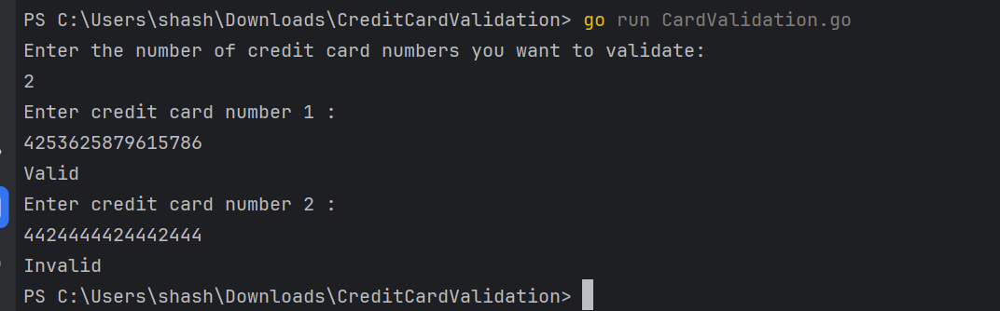

# Credit Card Validation using Regex

This program validates credit card numbers based on a set of predefined criteria using regular expressions.

## Requirements
- Go must be installed on your system.
- An IDE such as VS Code or GoLand

## How to Run the Program
1. **Clone or download** the project repository to your local machine.
2. **Open** the project in your preferred IDE (e.g., VS Code or GoLand).
3. **Navigate** to the project directory in a terminal window.
4. **Execute** the program by running the following command:
    ```shell
    go run CardValidation.go
    ```
5. **Input** the number of credit card numbers you want to validate when prompted.
6. **Provide** each credit card number one by one for validation when prompted.
7. The program will output whether each credit card number is "Valid" or "Invalid" based on the validation criteria.

After all the specified credit card numbers have been validated, the program will automatically terminate.

## Validation Criteria
The credit card numbers are validated based on the following criteria:
- Must start with a 4, 5, or 6.
- Must contain exactly 16 digits.
- Can be separated by one hyphen "-" every four digits.
- Must not contain any other separators (e.g., spaces, underscores).
- Must not contain four or more consecutive identical digits.

## Sample Output

